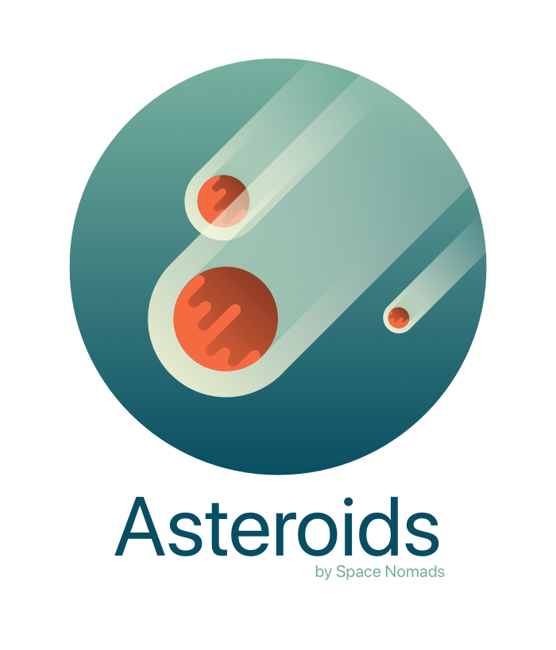

# Asteroids


 [](code_of_conduct.md)

Ahoy! This kit is my all-new/all-old web starter kit. Use it well!

<center>

</center>

With the help of [Gulp](https://gulpjs.com) and [11ty](https://www.11ty.dev/), Asteroids includes SCSS processing, JS minification and [Nunjucks](https://mozilla.github.io/nunjucks/), a super cool template engine created by Mozilla.

## Required steps: Installing Node and Gulp

To run Asteroids you'll need to have Node and Gulp installed:

- [NodeJS](https://nodejs.org/en) LTS version should be okay.
- [Gulp](https://gulpjs.com/) globally installed.

> 🤓 Running on Windows? Just remember to use the Git Bash console instead of that horrible thing called PowerShell.

### NodeJS

Go to the [official NodeJS website](https://nodejs.org/en) and download the version that best suits you. The LTS version should work fine. Install it, and your done :)

You can check if everything went okay by opening a terminal window and typing:

```shell
node -v
```

## Gulp

We'll need Gulp to process our SCSS and JS files because Eleventy doesn't do this.
Go to the [official Gulp website](https://gulpjs.com/docs/en/getting-started/quick-start) and follow the installing instructions. They should be something like open a terminal and type:

```shell
npm install --global gulp-cli
```

But it's best to check it out ;)

You can also check that everything went the way it was supposed to by opening a new terminal window and typing:

```shell
gulp -v
```

## Quickstart

Once you've installed both NodeJS and Gulp, let's run this starter kit:

1. Download or clone the repository.
2. Install the local dependencies with `$ npm i`.
3. Run the kit development stuff with `$ npm start`.

## Tasks

### Launch a web server for development

```shell
$ npm start
```

Launch Eleventy in serve mode and run some Gulp tasks to keep an eye on your SCSS/JS files to process and reload your project on port 8080

### Process a production-ready distribution

```shell
$ npm run build:pro
```

Delete and reprocess the dist folder with optimized versions of your HTML/CSS/JS files.

### Compress a production-ready distribution

```shell
$ gulp zipit
```

Delete and reprocess the public folder with optimized versions of your HTML/CSS/JS files and compress it in a .zip file.

The task picks the name of the project from the package.json "name" property.

It will generate an ignored `DDMMYY-hm-project-name.zip` file

## Folder structure

The **gulpfile.js** uses a configuration JSON file to set source and destination files of the project.
Check config.json out and edit what you need.

The project folder structure looks like this:

```txt
/.
├── _src/
│   ├── _data/
│   │   └── settings.js
│   ├── _templates/
│   │   └── layouts/
│   ├── assets/
│   │   ├── _domain/
│   │   ├── _icon/
│   │   ├── _scripts/
│   │   ├── _scss/
│   │   ├── css/
│   │   ├── fonts/
│   │   ├── images/
│   │   └── js/
│   └── index.njk
└── dist/
    ├── CNAME
    ├── assets/
    │   ├── css/
    │   ├── fonts/
    │   ├── images/
    │   └── js/
    ├── favicon.ico
    ├── humans.txt
    └── index.html

```

## CSS

Asteroids do not include a CSS reset stylesheet anymore, but we have added two awesome tools:

- A **csscomb** JSON file to use with your code editor as your own risk :)
- The media query combiner tool from @hail2u [**css-mqpacker**](https://github.com/hail2u/node-css-mqpacker/pkgs/npm/css-mqpacker).

## LINTERS AND STUFF

A few linter configurations are also included in Asteroids: Eslint, Stylelint and Markdown lint. You may need certain plugins or extensions for your code editor in order to use them.

> 👉 There is no such thing as a pre commit configuration or autoformat setting, these linters are only meant to show "problems" as you edit any JS/SCSS/MD file.

## Browser Support

That's up to you :), although you can find a "browserlist" property for the autoprefixer in the package.json file.

## TODO

So, what is next?

- [ ] Use SASS Dart.
- [ ] Process JS files: minify and obfuscate?
- [ ] Add a GitHub Pages action.
- [ ] Mobile icons + PSD source file.
- [X] Gulp task to generate a timestamped deploy folder. @done
- [X] Add CSS Linters. @done
- [X] Add JS Linters. @done
- [X] Use EJS/Nunjucks instead of PUG. @done
- [X] Quit using Jquery. @done
- [X] Migrate to 11ty. @done
- [X] ~~Update modernizr checkers~~. @wontDoIt
- [X] ~~Fix PUG/HTML reload loop~~. @wontDoIt

## Request a feature

Do you miss anything? Feel free to [request a feature](https://github.com/spacenomads/Asteroids/issues/new?assignees=oneeyedman&labels=%F0%9F%92%A1+New%21&template=---feature-request.md&title=) or contribute to making it better ;)
